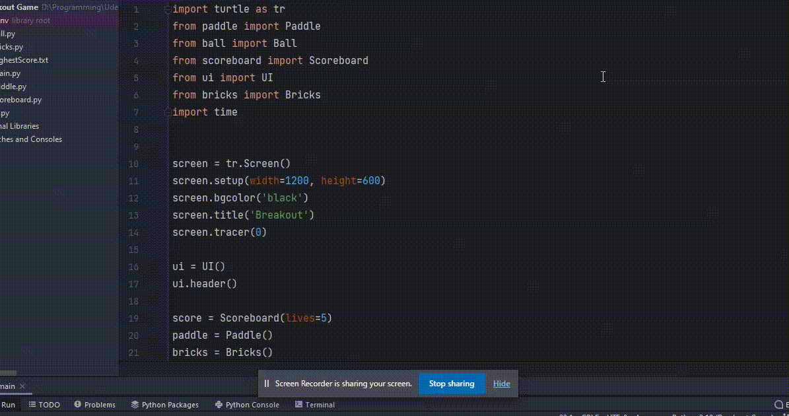

# Breakout Game
Clone of Breakout Game built using python turtle.

<h1> Guide to Building this Project </h1>

  

 
Checkout my article on <a href="https://www.geeksforgeeks.org/create-breakout-game-using-python/" target="_blank"> GeeksforGeeks </a> to learn how I built this project. 

  <h1> Program Flowchart </h1>
  

